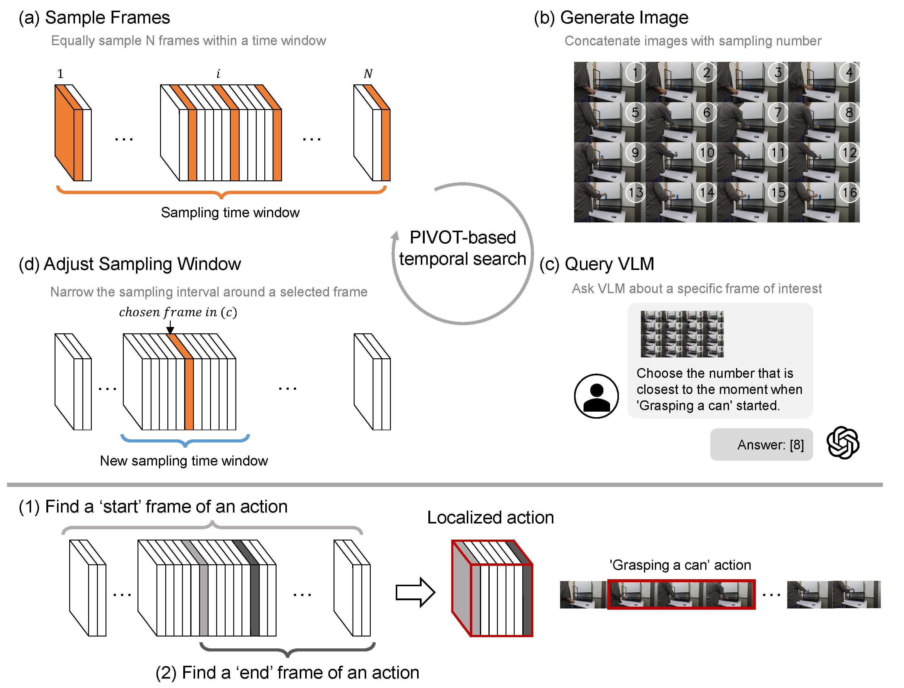

# VLM-Video-Action-Localization
This repository provides a sample code of a paper, [Open-vocabulary Temporal Action Localization using VLMs](https://arxiv.org/abs/2408.17422). This paper was authored by the [Applied Robotics Research](https://www.microsoft.com/en-us/research/group/applied-robotics-research/) team.

### Overview of the pipeline:


## How to use
We have confirmed that the sample codes work with python 3.12.1

Modify the [auth.env](./auth.env)

### If you use Azure OpenAI
- AZURE_OPENAI_DEPLOYMENT_NAME
- AZURE_OPENAI_ENDPOINT
- AZURE_OPENAI_API_KEY
### If you use OpenAI
- OPENAI_API_KEY

### Install dependencies
```bash
> pip install -r requirements.txt
```

### Run the sample code
```bash
python example.py --credentials auth.env --video sample_video/sample.mp4 --grid 3 --action "Grasping the can"
```
The `--grid N` option specifies the number of frames to extract, creating an image with an NxN grid tiling.
## Bibliography
```
@article{wake2024open,
  title={Open-vocabulary Temporal Action Localization using VLMs},
  author={Wake, Naoki and Kanehira, Atsushi and Sasabuchi, Kazuhiro and Takamatsu, Jun and Ikeuchi, Katsushi},
  journal={arXiv preprint arXiv:2408.17422},
  year={2024}
}
```

## Contributing

This project welcomes contributions and suggestions.  Most contributions require you to agree to a
Contributor License Agreement (CLA) declaring that you have the right to, and actually do, grant us
the rights to use your contribution. For details, visit https://cla.opensource.microsoft.com.

When you submit a pull request, a CLA bot will automatically determine whether you need to provide
a CLA and decorate the PR appropriately (e.g., status check, comment). Simply follow the instructions
provided by the bot. You will only need to do this once across all repos using our CLA.

This project has adopted the [Microsoft Open Source Code of Conduct](https://opensource.microsoft.com/codeofconduct/).
For more information see the [Code of Conduct FAQ](https://opensource.microsoft.com/codeofconduct/faq/) or
contact [opencode@microsoft.com](mailto:opencode@microsoft.com) with any additional questions or comments.

## Trademarks

This project may contain trademarks or logos for projects, products, or services. Authorized use of Microsoft 
trademarks or logos is subject to and must follow 
[Microsoft's Trademark & Brand Guidelines](https://www.microsoft.com/en-us/legal/intellectualproperty/trademarks/usage/general).
Use of Microsoft trademarks or logos in modified versions of this project must not cause confusion or imply Microsoft sponsorship.
Any use of third-party trademarks or logos are subject to those third-party's policies.
